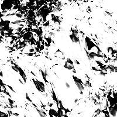
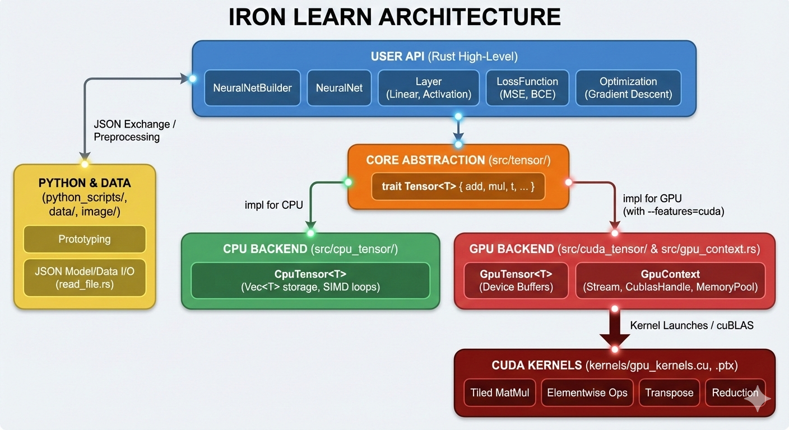

# Iron Learn ⚙️

[](https://opensource.org/licenses/MIT)

[](https://codecov.io/gh/Palash90/iron_learn)


A minimalistic Rust machine learning library with optional GPU-accelerated optimization. Built for learning tensor operations, gradient-based algorithms, and numerical computing with an emphasis on type safety and correctness.

## Features

- **GPU-Accelerated Training**: CUDA kernels for Tensor operations. Need to explicitly enable the feature. More on this later.
- **Comprehensive Tensor Support**: Two-dimensional arrays with generic numeric types
- **Complex Number Arithmetic**: Native support for complex-valued computations
- **Zero-Copy Operations**: Borrowing methods for efficient computation reuse

## Network Output

Before we deep dive into the nitty-gritties of the library, let's have a look on few of the examples the neural network presented:

1. [Image Reconstruction](#image-reconstruction)

## Quick Start

### Installation

Add to your `Cargo.toml`:

```toml
[dependencies]
iron_learn = "0.6"
```

### Basic Tensor Usage Example

```rust
use iron_learn::CpuTensor;
use iron_learn::Tensor;

// Create 2x2 matrices
let a: CpuTensor<f32> = CpuTensor::new(vec![2, 2], vec![1.0, 2.0, 3.0, 4.0]).unwrap();
let b: CpuTensor<f32> = CpuTensor::new(vec![2, 2], vec![5.0, 6.0, 7.0, 8.0]).unwrap();

println!("Original A:");
a.print_matrix();

println!("Original B:");
b.print_matrix();

// Add tensors without move
let sum = a.add(&b).unwrap();
println!("Sum:");
sum.print_matrix();

// Subtract tensors without move
let sum = a.sub(&b).unwrap();
println!("Difference:");
sum.print_matrix();

// Multiply tensors (Element wise multiplication)
let product = a.mul(&b).unwrap();
println!("Product:");
product.print_matrix();

// Multiply tensors  (Matrix multiplication)
let product = a.matmul(&b).unwrap();
println!("Dot Product:");
product.print_matrix();

// Divide tensors (Element wise division)
let result = a.div(&b).unwrap();
println!("Division:");
result.print_matrix();

// Transpose
let t = a.t().unwrap();
println!("Transpose of A:");
t.print_matrix();
```

For detailed example, check out [Examples](#examples)

## How to build and run

Prerequisites:

- Rust toolchain (stable or nightly depending on local setup): https://rustup.rs
- For GPU builds: CUDA Toolkit and an NVIDIA GPU (driver + nvcc). If you don't plan to use GPU tensors, CPU-only build is fine.
- Python 3.8+ for the scripts (optional). `cupy` is needed for running `python_scripts`.

The library has two modes - CPU and Cuda. Default is CPU, Cuda comes as an optional feature. If you have CUDA environment setup, you can use `--features=cuda` flag for building and running the code.

Build the basic CPU based Rust library and examples:

```bash
cargo build --release
```

Run unit tests:

```bash
cargo test
```

Run the Rust demonstration runners (examples):

```bash
# This is to get a comprehensive documentation of all the CLI Flags
cargo run -- -h
```

```bash
# Run a neural network example
cargo run
```

If you want to enable CUDA-backed tensors, ensure your environment has CUDA installed and visible to the linker. Typical workflow is the same `cargo build --features=cuda` but the code will initialize GPU devices at runtime when `init_gpu()` or `init_context()` is invoked.

Python scripts can be run directly:

```bash
python python_scripts/k-means.py
python anomaly_detection.py
```

`python_scripts/check_cuda.py` is a small utility to detect/validate CUDA availability from Python; useful for quick GPU checks.

## Examples

### Use GPU Tensor

```rust
# #[cfg(feature = "cuda")]
# {
use iron_learn::init_gpu;
use iron_learn::GpuTensor;
use iron_learn::Tensor;

init_gpu();
// Create 2x2 matrices
let a: GpuTensor<f32> = GpuTensor::new(vec![2, 2], vec![1.0, 2.0, 3.0, 4.0]).unwrap();
let b: GpuTensor<f32> = GpuTensor::new(vec![2, 2], vec![5.0, 6.0, 7.0, 8.0]).unwrap();

println!("Original A:");
a.print_matrix();

println!("Original B:");
b.print_matrix();

// Add tensors without move
let sum = a.add(&b).unwrap();
println!("Sum:");
sum.print_matrix();

// Subtract tensors without move
let sum = a.sub(&b).unwrap();
println!("Difference:");
sum.print_matrix();

// Multiply tensors (Element wise multiplication)
let product = a.mul(&b).unwrap();
println!("Product:");
product.print_matrix();

// Multiply tensors (Matrix multiplication)
let product = a.matmul(&b).unwrap();
println!("Dot Product:");
product.print_matrix();

// Divide tensors (Element wise division)
let result = a.div(&b).unwrap();
println!("Division:");
result.print_matrix();

// Transpose
let t = a.t().unwrap();
println!("Transpose of A:");
t.print_matrix();

# }
```

### Use Neural Network

```rust
use iron_learn::nn::types::TrainingConfig;
use iron_learn::nn::types::TrainingHook;
use iron_learn::nn::DistributionType;
use iron_learn::nn::LayerType;
use iron_learn::CpuTensor;
use iron_learn::MeanSquaredErrorLoss;
use iron_learn::NeuralNet;
use iron_learn::NeuralNetBuilder;
use iron_learn::Tensor;

let mut nn = NeuralNetBuilder::<CpuTensor<f32>, f32>::new();

let x: CpuTensor<f32> =
        CpuTensor::new(vec![4, 2], vec![0.0, 0.0, 0.0, 1.0, 1.0, 0.0, 1.0, 1.0]).unwrap();
let y: CpuTensor<f32> = CpuTensor::new(vec![4, 1], vec![0.0, 1.0, 1.0, 0.0]).unwrap();

let monitor =
    |epoch: usize, err: f32, current_lr: f32, nn: &mut NeuralNet<CpuTensor<f32>, f32>| {
          println!("Processing epopch: {epoch}, error: {err}");
    };

nn.add_linear(2, 4, "Input", &DistributionType::Uniform);
nn.add_activation(LayerType::Tanh, "Activation Layer");

nn.add_linear(4, 1, "Hidden", &DistributionType::Uniform);
nn.add_activation(LayerType::Sigmoid, "Output");

let loss_function_instance = Box::new(MeanSquaredErrorLoss);

let mut net = nn.build(loss_function_instance, &"neural-net".to_string());

let config = TrainingConfig {
      epochs: 5,
      epoch_offset: 0,
      base_lr: 1.0,
      lr_adjustment: false,
  };

let monitor = |epoch: usize, err: f32, lr: f32, _nn: &mut NeuralNet<CpuTensor<f32>, f32>| {
    println!("Processing epopch: {epoch}, error: {err}");
};

let hook_config = TrainingHook::new(1, monitor);

net.fit(&x, &y, config, hook_config);

let prediction = net.predict(&x).unwrap();
println!("\nPredicted value");
prediction.print_matrix();
```

## Image Reconstruction

In one of the POCs with a ~99K parameter vanilla neural network, I have tried the Universal Approximation Theorem to reconstruct an image. Following are few snaps from the training of a very complex funtion (an image of Simba).

### The random noise the network started with



### Reconstructed image after 200,000 epochs


### Reconstructed image after 800,000 epochs


For comparison, Following is the original image fed to the network.

### Original Image


### Reconstructed image at higher pixels (200 x 200 reconstructed at 512 x 512)


### Time lapse of regeneration step by step


You can find all the regenerated images in [model_outputs/image/images](model_outputs/image/images) directory.

## High-level Overview of the components

- Rust: Core `Tensor` abstraction implementing `Tensor`s, numeric abstractions, optimization (gradient descent), neural network primitives, and optional CUDA-backed tensor implementations.
- CUDA: `kernels/` contains CUDA kernels used by the Rust `cuda_tensor` and `gpu_context` modules for accelerated matrix ops.
- Python: `python_scripts/` contains helper scripts, experiments and small neural-network examples used for prototyping and data preprocessing.
- Data/Images: Example JSON metadata and image assets under `data/` and `model_outputs/` used by demos and scripts.

## Architecture


_Architecture diagram generated by Gemini (AI by Google)._

_The diagram above illustrates the relationship between the high-level Rust API, the Core Tensor abstractions, and the dual-backend (CPU/GPU) execution model._

## Quick Module Reference

**Tensor API**

- **Purpose:** Core trait `Tensor<T>` defines creation (`new`, `zeroes`, `ones`), shape/data accessors (`get_shape`, `get_data`), linear algebra (`add`, `sub`, `mul`, `t`, `multiply`, `div`, `scale`, `clip`) and reducers (`sum`). See `src/tensor/mod.rs` for the trait and basic docs.

_NB:_ The library does not yet support broadcasting. I will soon introduce broadcasting logic.

**CpuTensor (CPU backend)**

- **Purpose:** `CpuTensor<T>` implements `Tensor<T>` for CPU operations with plain Rust `Vec<T>` storage and row-major layout. See `src/cpu_tensor/mod.rs`.
- **Highlights:** explicit shape validation, element-wise math helpers, an inner `_cpu_mul` implementation optimized for clarity and basic SIMD-friendly loops, and numerically-stable sigmoid in `element_op`.
- **Limitations:** Currently restricted to 1D/2D tensors.

**GpuTensor (CUDA backend)**

- **Purpose:** `GpuTensor<T>` provides a CUDA-backed `Tensor` using device buffers, kernels from `kernels/gpu_kernels.cu`, and optional cublas-accelerated multiplication (`_gpu_mul_cublas`). See `src/cuda_tensor/mod.rs` and `src/gpu_context.rs` for initialization.
- **Highlights:** device memory pooling, kernel launches via `cust::launch!`, functions for elementwise ops (`element_op`), clipping, transpose (naive), tiled matrix multiply, and column-wise reduce. Uses `GPU_CONTEXT` to find module/function handles.
- **Notes:** GPU ops require `init_gpu()` to be called and a valid `GpuContext`. Multiplication defaults to `cublasSgemm` path when available.
- **Limitations:** Currently restricted to 1D/2D single precision floating point tensors. If any other data type is used, the result may not be returned as expected.

**GPU Context**

- **Purpose:** `src/gpu_context.rs` exposes `init_gpu(...)` and `GPU_CONTEXT` (global OnceLock). It stores CUDA `Module`, `Stream`, `CudaMemoryPool`, and a `CublasHandle` used by `GpuTensor`.

**Gradient Descent / Regression**

- **Purpose:** `src/gradient_descent.rs` implements `gradient_descent`, `linear_regression`, `logistic_regression`, and helpers `predict_linear`, `predict_logistic`. The functions expect `Tensor<f64>` with `TensorMath<f64>` support and follow standard batch gradient updates with optional logistic sigmoid.

**Neural Network**

- **Purpose:** High-level NN abstraction in `src/neural_network/`. Use `NeuralNetBuilder` to add `Linear` layers (`LinearLayer`) and activations (`ActivationLayer`) and then `build()` a `NeuralNet` instance.
- **Model Persistence:** `ModelData` (see `src/neural_network/mod.rs`) serializes model metadata:
  - `name`: model name
  - `parameter_count`: total parameters
  - `layers`: list of `LayerData` objects (`layer_type`, `name`, `index`, `weights`, `shape`)
  - `epoch`: last saved epoch, such that you can resume the Neural Network where is left last.
  - `saved_lr`: learning rate saved with the model. Right now two learning rate adjustment is supported - None (no change in learning rate) and cos annealing.

**CUDA Kernels (quick API map)**

- Located at `kernels/gpu_kernels.cu`. Main exported kernels (extern "C"):
  - `fill_value(float *out, int n, float value)` — fill buffer
  - `vector_arithmatic(const float *a, const float *b, float *out, int n, unsigned int op)` — add/sub/mul/div
  - `clip(const float *s, float *r, int n, float min, float max)` — clip values
  - `element_op(const float *s, float *r, int n, int op, float scale)` — exp/sin/cos/tanh/sigmoid/log
  - `compare_memory(const float *a, const float *b, size_t size, int *result)` — compare arrays
  - `transpose_naive(const float *A, float *B, int M, int N)` — naive transpose
  - `matrix_mul(const float *A, const float *B, float *C, int M, int N, int K)` — tiled matmul using shared memory
  - `column_reduce(const float *inputMatrix, float *outputSums, int numRows, int numCols)` — column sums

**Python scripts (where to look)**

- `python_scripts/neural_net/*` — prototype Python-side neural net builder and helpers used for experiments and model JSON creation.
- `anomaly_detection.py` — feature-wise Gaussian estimation and F1-based threshold selection (useful as a standalone script).

**Data & Model JSONs**

- Example dataset: see `data/image.json` (fields: `m`, `n`, `m_test`, `x`, `y`, `x_test`, `y_test`) — JSON contains flattened row-major arrays for `x`/`y`.
- Example model file: see `model_outputs/image/model.json` — follows `ModelData` schema described above. Use `read_file::deserialize_model()` to load models into `ModelData`, and `NeuralNetBuilder::build_from_model()` to restore a runtime `NeuralNet` from `ModelData`.

## Repository Structure

- `src/` — Rust library and binaries

  - `tensor/` — Tensor trait and backend implementations (CPU/GPU implementations live in `cpu_tensor/` and `cuda_tensor/`).
  - `neural_network/` — High-level NN builder, layers, activations and loss functions.
  - `gradient_descent.rs` — CPU implementations of linear and logistic regression and helper routines (normalization, bias handling).
  - `gpu_context.rs`, `cuda_tensor/` — GPU initialization and device-backed tensor types (CUDA interop, cublas wrappers, memory pools).
  - `read_file.rs` — Helpers for loading JSON model/data artifacts.
  - `runners.rs` — Small CLI-like routines for running `run_linear`, `run_logistic`, and `run_neural_net` examples.

- `kernels/` — CUDA device code

  - `gpu_kernels.cu` — Implementations for tiled matrix multiplication, elementwise ops, clipping, transpose and reductions.
  - `gpu_kernels.ptx` — Precompiled PTX shipped alongside the CUDA source.

- `python_scripts/` — Python utilities and experiments

  - Top-level scripts: `k-means.py`, `check_cuda.py`, `plot_graph.py`, etc.
  - `neural_net/` — Small Python builder, activation, layers and helpers used for rapid prototyping and educational examples.

- `data/`, `model_outputs/image/` — Example datasets, model JSONs and saved weights used by demos.

## What each major component does

**Rust: `src/`**

- `tensor` (trait & implementations): Core abstraction exposing operations such as `add`, `mul`, `transpose`, elementwise math (`sin`, `cos`, `sigmoid`, etc.), and shape/data accessors. Backends implement `TensorMath` for mathematical functions.
- `cpu_tensor/`: Pure CPU tensor implementation used for most algorithms and tests. Most of these are Auto-Vectorized for parallel computation support.
- `cuda_tensor/`: CUDA-backed tensor implementation with device buffers and memory pooling. Integrates with `gpu_context` and uses kernels from `kernels/`.
- `neural_network/`: Provides a `NeuralNetBuilder` and a runtime `NeuralNet` type. Layers implement a `Layer<T>` trait; `LinearLayer` handles weight matrices and updates while `ActivationLayer` applies elementwise activations (sigmoid/tanh/linear/sin). `loss_functions.rs` contains `MeanSquaredErrorLoss` and `BinaryCrossEntropy` used for backprop.
- `gradient_descent.rs`: Implements `linear_regression`, `logistic_regression`, plus helper functions `predict_linear`, `predict_logistic`, and `gradient_descent` steps. Also contains `normalize_features` exposed from `commons`.
- `gpu_context.rs` and `cuda_tensor/*`: Manage GPU initialization, cuBLAS/cuDNN handles (where applicable), custom device buffers, and a simple memory pool to reduce allocations when transferring data.
- `runners.rs`: Provides convenience runners used by the CLI entrypoints (`main.rs`) to invoke example training runs.

**CUDA: `kernels/gpu_kernels.cu`**

- Implements atomic-safe memory comparison, element-wise math device kernels (exp, sin, cos, sigmoid branch), vector arithmetic, clipping, tiled matrix multiplication (shared-memory, TILE_SIZE 16), transpose and column reductions. These kernels are used by `cuda_tensor` for operations like `mul`, `transpose`, `col_reduce` and elementwise transforms (sigmoid, ln, exp).

**Python: `python_scripts/`**

- `anomaly_detection.py`: Implements Gaussian estimation and threshold selection (F1-based) for anomaly detection — a direct NumPy port of the typical ML course algorithms (estimate Gaussian and select threshold by F1 score).
- `neural_net/` folder: Small Python builder, activation, layers and helpers used for experimentation and generating JSON `ModelData` artifacts that can be consumed by the Rust `read_file`/builder logic.

## Where to look for functionality you might extend or inspect

- Implement new layers / activations: `src/neural_network/` (add `Layer` impls and wire into `NeuralNetBuilder`).
- Change tensor math: `src/tensor/` traits and `src/cpu_tensor` / `src/cuda_tensor` implementations.
- Add GPU kernels: `kernels/gpu_kernels.cu` and regenerate PTX if required; then extend `cuda_tensor` to call new kernels.
- Add CLI runners: `src/runners.rs` and `src/main.rs`.

## Notes

- The Rust `NeuralNetBuilder` supports building from scratch or restoring `ModelData` (weights loaded from JSON). Layers expose `get_parameters()` for serialization.
- `ActivationLayer` caches outputs; activations (sigmoid, tanh, sin, linear) are implemented in `activations.rs` using the `TensorMath` trait.
- `LinearLayer` performs forward via `input.mul(&self.weights)` and backward by computing `weights_grad = input.T * error` then updating `self.weights = self.weights - lr * weights_grad`. Used a bias trick to avoid Broadcasting. Will soon add Broadcasting support.
- `loss_functions.rs` includes stable BinaryCrossEntropy (clipping predictions to avoid log/divide-by-zero) and an MSE implementation.
- CUDA kernels implement a tiled matrix multiply and common elementwise ops; the kernels use shared memory and boundary checks for correctness.

## Quick pointers for contributors

- Run tests: `cargo test`
- Format: `cargo fmt`
- Lint: `cargo clippy` (may require installing `clippy` via rustup)
- Keep Python examples and the Rust model importer (`read_file.rs`) in sync if you change JSON model formats.

## Next steps

- Add Broadcasting support
- Axis wise reducer
- Move to higher dimensions
